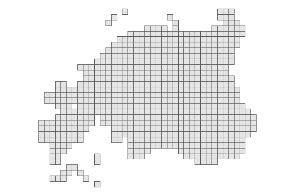
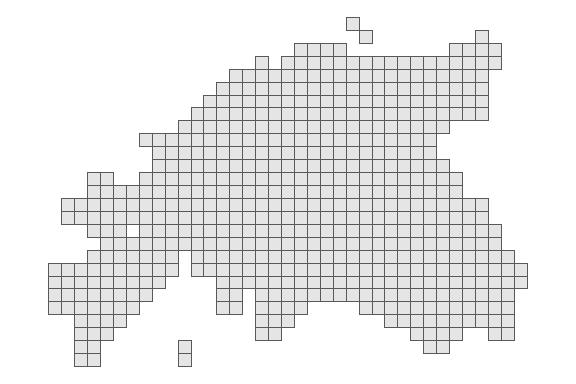
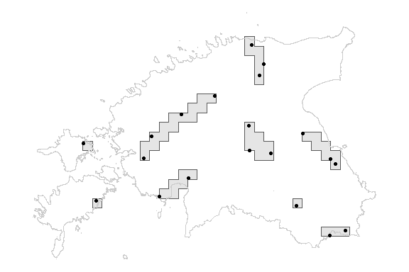

hdarticle17range: Distribution and range calculation tool for Habitats
Directive Article 17 reporting
================

## Overview

Package ‘hdarticle17range’ implements several functions that simplify
distribution and range calculation of species and habitat types in
various member states and biogeographical regions.

Range of a species or habitat type is a crucial parameter in Article 17
reporing under Habitats Directive. While distribution is a
representation of the occurrences in the 10x10 km grid, range
calculation is more sophisticated. Range is obtained by generalizing the
distribution, by creating envelope(s) around the distribution grids
using a parameter named ‘gap distance’ (DG Environment 2023).

#### Datasets

| Dataset | Description |
|:---|:---|
| eu10km | EEA reference grid (10 km) geometries (EEA 2024a). |
| biogeoregions10km | EEA refecence grid (10 km) of biogeographic regions EEA (2022). |
| ms10kmcells | EEA reference grids (10 km) of member states (EEA 2024a). |
| gapdistance | Default gap distance for species and habitats. |
| eesti | Simplified country borders for Estonia. |

### Functions

| Function | Description |
|:---|:---|
| ms_region_reference_grid() | Prepare a reference related to specific member state and biogeographic region. |
| features_to_range() | Calculate distribution and range from input occurence data, reference grid and gap distance. |

## Installation

You can install the development version from
[GitHub](https://github.com/) with:

``` r
# install.packages("devtools")
devtools::install_github("leivimee/hdarticle17range")
```

## Usage

``` r
# load packages
library(hdarticle17range)
```

Grid cells of a biogeographic regions in specific member state (MS) can
be obtained with a function called ‘ms_region_reference_grid’. The
function takes two important arguments – ‘memberstate’ and
‘biogeoregion’. For example, to retrieve the reference grid for Estonia
in Boreal biogeographic region, one can call:

``` r
# prepare cells
eebor10km <- ms_region_reference_grid("EE", "BOR")
# load ggplot2 for graphic output
library(ggplot2)
# plot
ggplot(data = eebor10km)+
  geom_sf()+
  theme_void()
```

<!-- -->

The function makes a query from grid cells that have intersection with
both – with the EEA given MS grid cells and EEA given BG regions.
Sometimes it is needed to exclude some cells that are common with some
neighbouring MS. It is possible to fine tune the reference grid by
providing country borders.

``` r
# load example dataset
data(eesti)
# prepare cells
eebor10kmee <- ms_region_reference_grid("EE", "BOR", eesti)
```


``` r
# plot
ggplot(data = eebor10kmee)+
  geom_sf()+
  theme_void()
```

<!-- -->

Lets calculate distribution and range maps from dummy data.

``` r
# set seed for reproducible example
set.seed(69)
# generate 20 random points
exa_spe_occ <- sf::st_as_sf(sf::st_sample(eesti, 20))
exa_spe_range <- features_to_range(exa_spe_occ, eebor10kmee)
```


Examine the structure of output.

``` r
str(exa_spe_range)
```

    ## List of 2
    ##  $ dist :List of 3
    ##   ..$ dist :sfc_POLYGON of length 20; first list element: List of 1
    ##   .. ..$ : num [1:5, 1:2] 5310000 5310000 5320000 5320000 5310000 3950000 3960000 3960000 3950000 3950000
    ##   .. ..- attr(*, "class")= chr [1:3] "XY" "POLYGON" "sfg"
    ##   ..$ area : Units: [km^2] num 2000
    ##   ..$ cells: chr [1:20] "10kmE531N395" "10kmE533N395" "10kmE507N398" "10kmE528N398" ...
    ##  $ range:List of 3
    ##   ..$ range:sfc_POLYGON of length 9; first list element: List of 1
    ##   .. ..$ : num [1:5, 1:2] 5070000 5080000 5080000 5070000 5070000 3990000 3990000 3980000 3980000 3990000
    ##   .. ..- attr(*, "class")= chr [1:3] "XY" "POLYGON" "sfg"
    ##   ..$ area : Units: [km^2] num 4700
    ##   ..$ cells: chr [1:47] "10kmE531N395" "10kmE532N395" "10kmE533N395" "10kmE514N399" ...

The output consists of a list with elements **dist** and **range**.
Element **dist** contains a list with three elements:

**dist**  
geometry (sfc POLYGON) of grid cells

**area**  
area (units) of distribution in units \[km^2\]

**cells**  
a vector (character) containing cell codes

Element **range** contains a list with three elements:

**range**  
geometry (sfc POLYGON) of grid cells

**area**  
area (units) of range in units \[km^2\]

**cells**  
a vector (character) containing cell codes

Plot the range object.

``` r
ggplot(data = exa_spe_range$range$range)+
  geom_sf()+
  geom_sf(data=eesti, fill=NA, color="#cccccc")+
  geom_sf(data=exa_spe_occ)+
  theme_void()
```

<!-- -->

## References

<div id="refs" class="references csl-bib-body hanging-indent"
entry-spacing="0">

<div id="ref-guidelines" class="csl-entry">

DG Environment. 2023. “Reporting Under Article 17 of the Habitats
Directive: Guidelines on Concepts and Definitions – Article 17 of
Directive 92/43/EEC, Reporting Period 2019-2024. Brussels. Pp 1.”

</div>

<div id="ref-msfdregions" class="csl-entry">

EEA. 2022. “MSFD Regions and Subregions - Version 2, Oct. 2022.”
<https://sdi.eea.europa.eu/catalogue/srv/api/records/a60e171d-e2a8-4dc5-a765-c2bdabbdbce6>.

</div>

<div id="ref-eearefgrid" class="csl-entry">

———. 2024a. “EEA Reference Grid.”
<https://sdi.eea.europa.eu/catalogue/srv/api/records/3c362237-daa4-45e2-8c16-aaadfb1a003b>.

</div>

<div id="ref-biogeoregions" class="csl-entry">

———. 2024b. “Biogeographical Regions.”
<https://www.eea.europa.eu/en/datahub/datahubitem-view/11db8d14-f167-4cd5-9205-95638dfd9618>.

</div>

</div>
